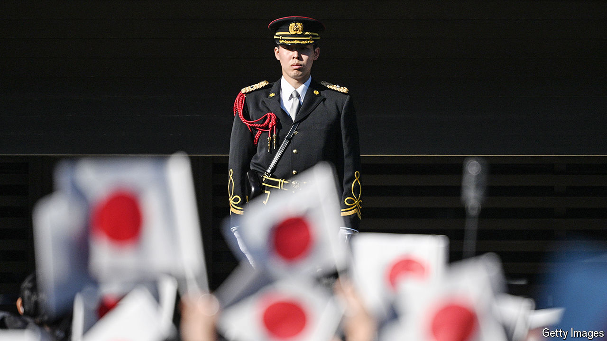

###### Japanese defence

# Is this a new age of warrior Japan? 

##### The country is spending more on its armed forces. But not everyone is on board 

 

> Jul 22nd 2024 

IMAGINE a weekend outing for a Japanese family, and a tour of a warship may not come to mind. Yet thousands came to see the , a light aircraft-carrier, when it moored off Sendai, on Japan’s north-east coast, earlier this month. Children scrambled around a helicopter on the deck. Enthusiasts snapped photos of anti-aircraft turrets. Many expressed gratitude for the Self-Defence Forces (SDF), as Japan’s armed forces are called. “The SDF protects us. It’s a wonderful thing,” gushed Yamazaki Saori, who took her daughter. “Japan is facing so many threats.” 

