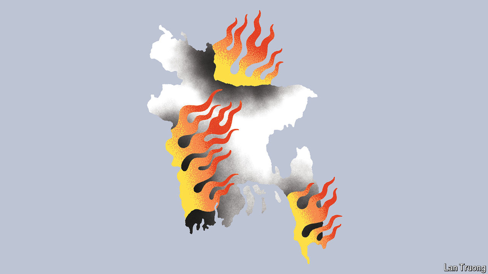

###### Banyan

# Sheikh Hasina faces her biggest crisis in years 

##### Bangladesh’s prime minister shuts down the country 

 

> Jul 25th 2024 

THE FEROCITY of the crisis this month in Bangladesh is unprecedented during the rule of Sheikh Hasina, the country’s ever-more-authoritarian prime minister. It was triggered when university students came out in protest against a jobs quota in the civil service. They clashed with police and the ruling party’s thuggish student wing and seized control of the streets of the teeming capital, Dhaka. They also stormed the state broadcaster, while violence spread to nearly half the country’s 64 districts. In response, the government sent in armed troops and, from July 20th, imposed a nationwide curfew enforced by a shoot-to-kill order. It also shut down internet services, cutting off a country of 171m from the world and from itself until a partial restoration on July 23rd.

