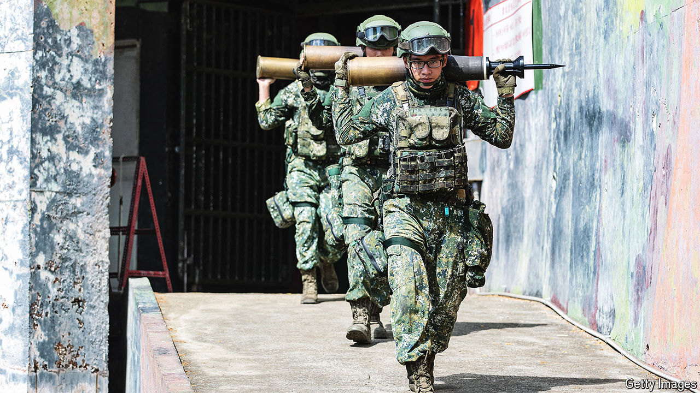

###### Pomp and preparation

# Taiwan is beefing up its military exercises to counter China 

##### The island’s new defence minister wants more practice and less performance 

 

> Jul 25th 2024 

The annual Han Kuang exercises are Taiwan’s biggest military drills, focused on countering Chinese invasion. They have also been criticised as being largely a public-relations exercise. In the past Taiwanese special forces and marines would don red hats that marked them as Chinese invaders, then act out attempted beach landings or airport takeovers. Announcers would narrate how Taiwan’s armed forces had repelled them live on television, as the president watched in approval. It was a good show, but poor practice for war. Last year a woman was filmed sunbathing in a bikini on the same beach where Taiwan’s army and navy were enacting a Chinese amphibious landing. 

