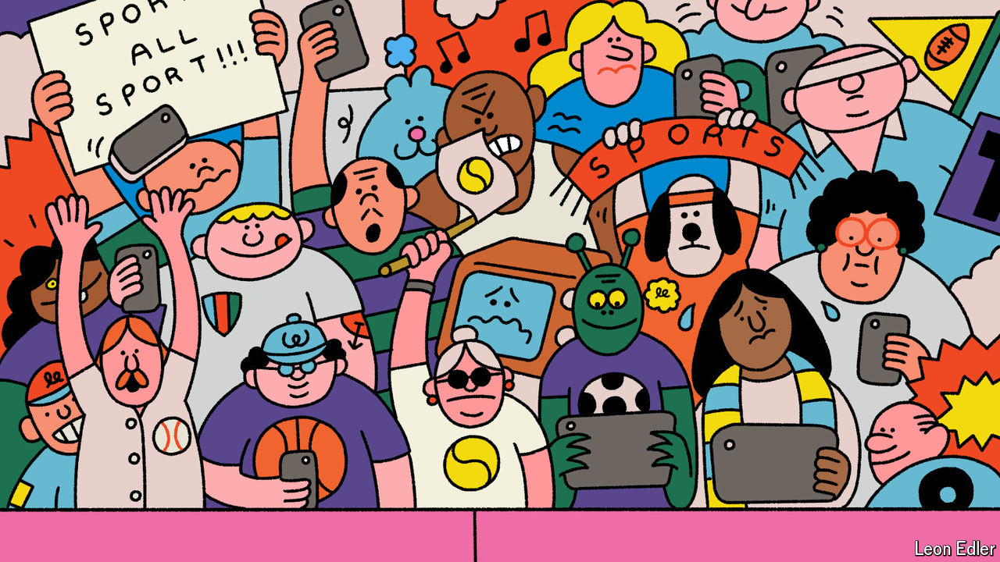

###### The state of play

# A shift in the media business is changing what it is to be a sports fan 

##### Team loyalty is being replaced by “fluid fandom” 

 

> Jul 25th 2024 

The first television broadcast of an Olympic games was in 1936, when around 160,000 people within transmitting range of the stadium in Berlin were able to tune in. The action was shot on three cameras, only one of which could capture live footage—and only when the sun was out. At the next summer games, in London in 1948, the BBC suggested that perhaps it should pay the organisers for the right to broadcast the event, and offered 1,000 guineas (about $40,000 at today’s prices). The Olympic committee sportingly said there was no need.

