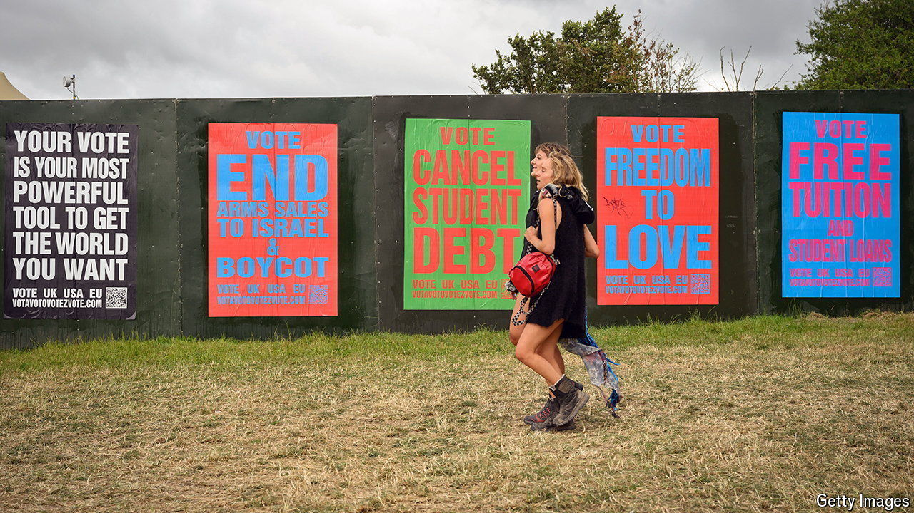

###### Turnout trouble

# Are Britons losing the habit of voting? 

##### One low-turnout election is not alarming. But there is a deeper problem 

 

> Jul 22nd 2024 

“I didn’t even know it was on,” says Jonathan in Ebbw Vale, a small town in south Wales. Along with four other construction workers who have gathered for a post-work pint in the Picture House pub, he says he did not vote in the general election. He does not remember a canvasser knocking on his door, and says the only leaflets he received before the election came from local kebab shops. In the chair next to him, Kyle is even more apathetic. “I’m 35 and I’ve never voted,” he says. “Never have, never will.”

