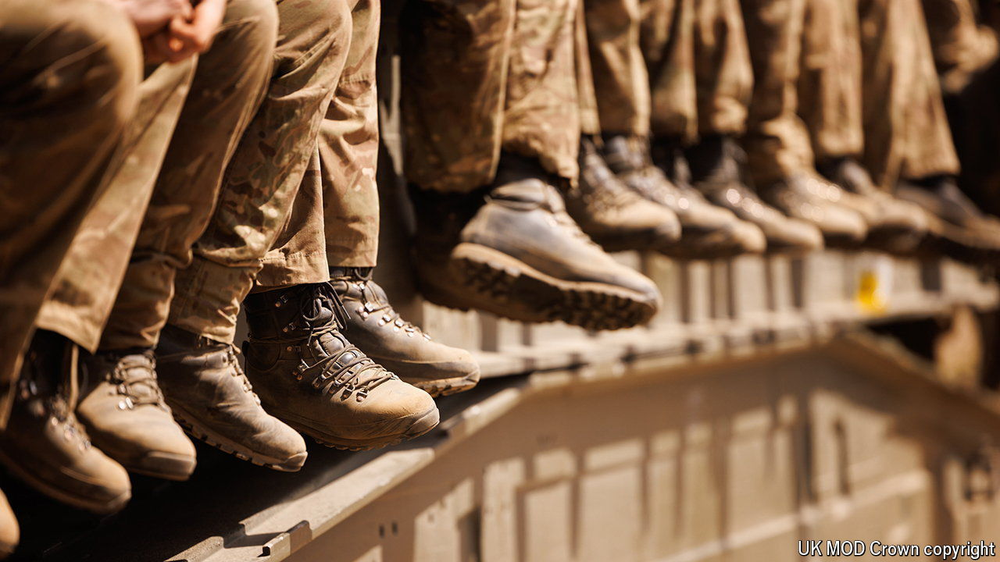

###### Fighting talk

# Britain’s army chief fears war may come sooner than anyone thinks 

##### Could the army cope without more money and troops? 

 

> Jul 25th 2024 

THE HALL OF Church House, nestled next to Westminster Abbey, is full of pious exhortations to peace and love. On July 22nd-23rd it was filled with military officers debating how to kill people more efficiently. General Sir Roly Walker, who became chief of the general staff in June, was one of those addressing the army’s annual land-warfare conference, run by the Royal United Services Institute (RUSI), a think-tank. In his speech he set out his aim “to double our fighting power in three years and triple it by the end of the decade”.

