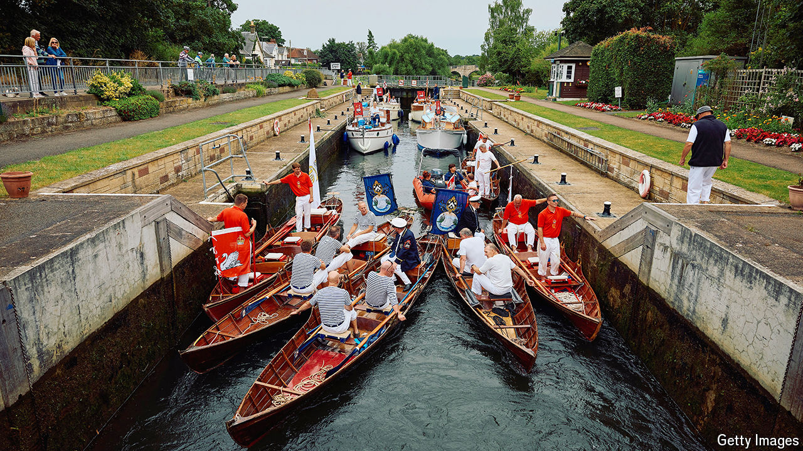

###### Swan-upmanship

# How King Charles III counts his swans 

##### A ritual that pleases conservationists and annoys the birds 

 

> Jul 25th 2024 

Charles III, the Most High, Most Mighty and Most Excellent Monarch of the United Kingdom of Great Britain and Northern Ireland and of His other Realms and Territories, has many grand titles, some sensible and plenty not. He is Head of the Armed Forces and the Defender of the Faith. He is Sovereign of the Most Noble Order of the Garter and Chieftain of the Braemar Gathering. He is also Seigneur of the Swans, a title which tends to be forgotten partly because it is ridiculous and partly because it does not matter. Unless you are a swan. Because as Seigneur of the Swans,  has droits over you. And in July, he exercises them. 

