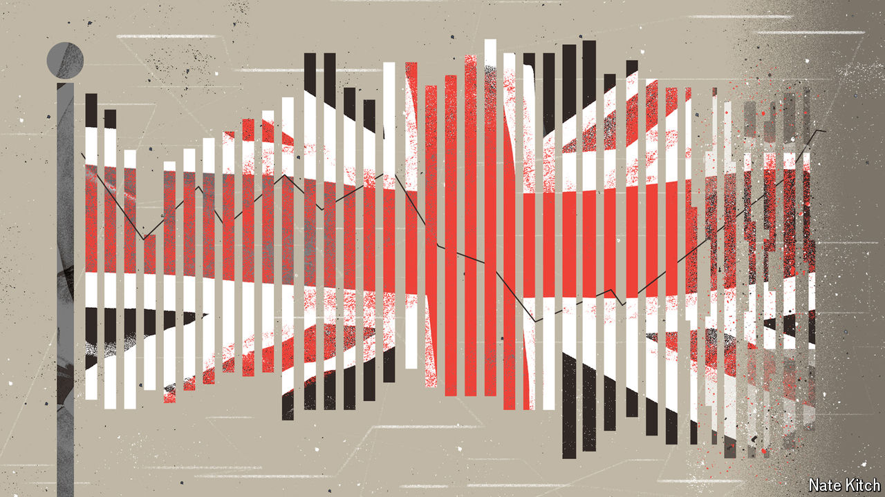

###### Labour’s honeymoon

# Is Britain’s economy finally moving? 

##### Sticky inflation and a weakening job market could still spoil the mood 

 

> Jul 23rd 2024 

In its first weeks in office the new Labour government is hammering away at one message: on prisons, the National Health Service, the armed forces and more, the Tories left behind a terrible inheritance. It is no different for the economy. Rachel Reeves, the chancellor, says Labour has been handed the worst economy of any incoming government since 1945, when Britain was loaded with wartime debt and its cities pockmarked with craters. 

