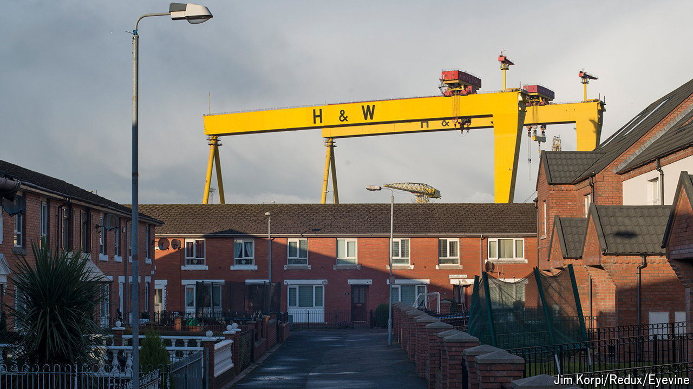

###### A Belfast symbol

# The builder of the Titanic is struggling to stay afloat 

##### Harland and Wolff is fighting for its life 

 

> Jul 25th 2024 

When it built the  in 1911, Harland and Wolff was the world’s biggest shipyard. Where it once employed 35,000 people, there are now just a few hundred workers. But the 163-year-old company remains an institution whose significance to Belfast outweighs its size. Its own increasingly desperate struggle to stay afloat is of symbolic importance to the city and the wider shipbuilding industry. It also provides clues to the willingness of the new Labour government to help out troubled firms. 

