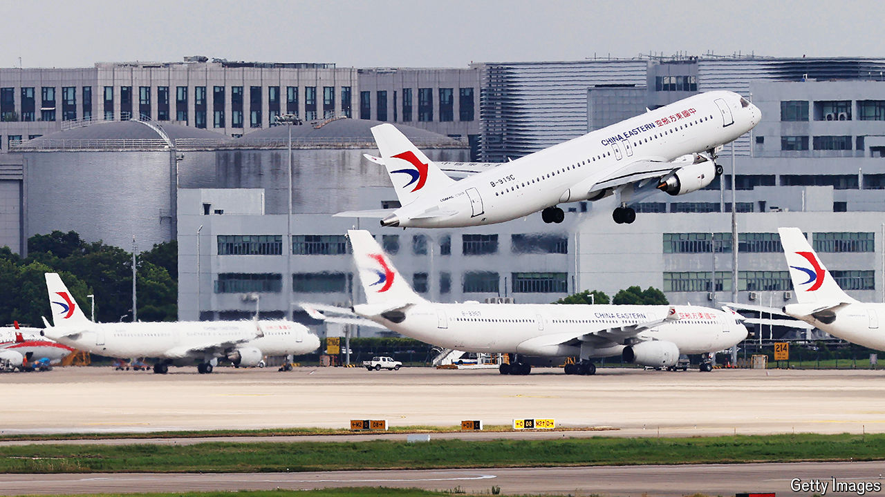

###### Dogfight

# Can China smash the Airbus-Boeing duopoly? 

##### It hopes to succeed where others have failed 

 

> Jul 25th 2024 

Each year Airbus and Boeing, the two halves of the global aircraft duopoly, face off at the world’s most prestigious airshow, which alternates between Paris and Farnborough, in the countryside close to London. This year’s event in Farnborough, which opened on July 22nd, was a more subdued clash than usual. Both firms announced some orders from airlines, but these were mostly small.

