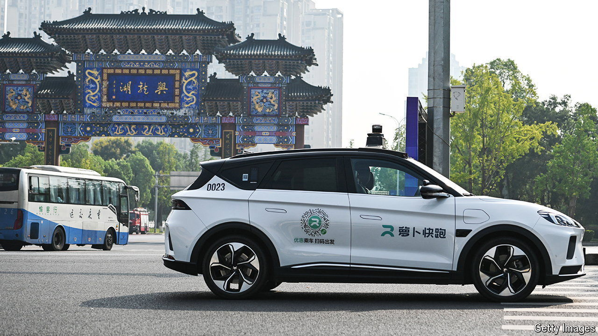

###### Bump start

# China’s robotaxis are racing ahead of Tesla’s 

##### Baidu is leaving Western carmakers in the dust 

 

> Jul 24th 2024 

If autonomous cars are supposed to make life easy, then Apollo Go, the robotaxi unit of , a Chinese tech giant, still has work to do. When your correspondent tested its service in the city of Wuhan he had to find his way to a designated pick-up location and end his journey at an approved drop-off spot—more like taking a bus than a cab.

