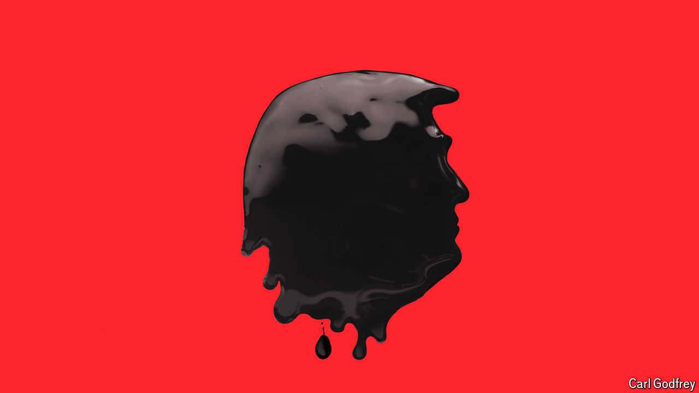

###### A fossil-fuel fantasy

# Donald Trump’s promise of a golden age for oil is fanciful 

##### There is not much he could do to boost fossil fuels—or rein in clean energy 

 

> Jul 24th 2024 

“We will drill, baby, drill!” So thundered Donald Trump in his speech on July 19th at the , where he accepted his party’s nomination as its presidential candidate. Encouraged by rapturous applause, he warmed to the theme, vowing to boost domestic production of fossil fuels to “levels that nobody’s ever seen before”, making America so “energy dominant” that it “will supply the rest of the world”. 

