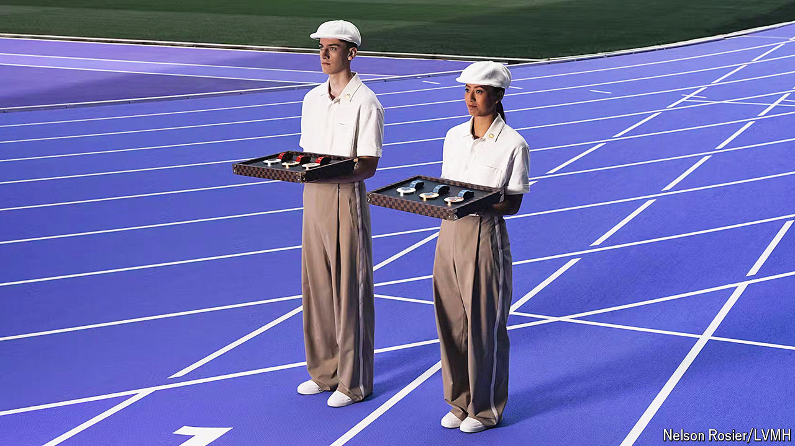

###### Prestige and the podium

# LVMH is splurging on the Olympics 

##### Will it pay off? 

 

> Jul 25th 2024 

Pay close attention as the medals are draped over the victors of this year’s Olympic games in Paris and you may spot a hexagonal piece of wrought iron at their centre. That is a piece of the Eiffel Tower, kept after a renovation. The medals, designed by Chaumet, part of the luxury giant LVMH, are but one example of how the conglomerate’s  will be adding an opulent touch to the games. France’s team will don Berluti garments for the opening ceremony on July 26th. VIP lounges have been stocked with the  of Moët Hennessy. Even the torch has been kept in a Louis Vuitton checkerboard trunk.

