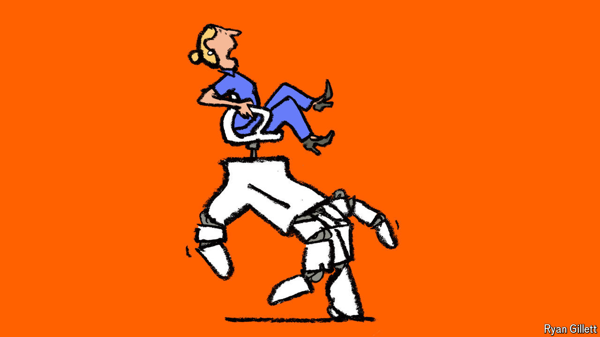

###### Bartleby

# Machines might not take your job. But they could make it worse 

##### How robots and AI change the meaningfulness of work 

 

> Jul 25th 2024 

July 19th was a day for help-desk heroes and support superstars. A routine software update by CrowdStrike, a cyber-security company, caused computer outages in offices, hospitals and airports worldwide. Most white-collar workers looked disconsolately at their screens and realised just how useless they are if they cannot log in. People in IT came to the rescue of helpless colleagues and stranded passengers. Their work that day was full of stress—but also full of meaning. 

