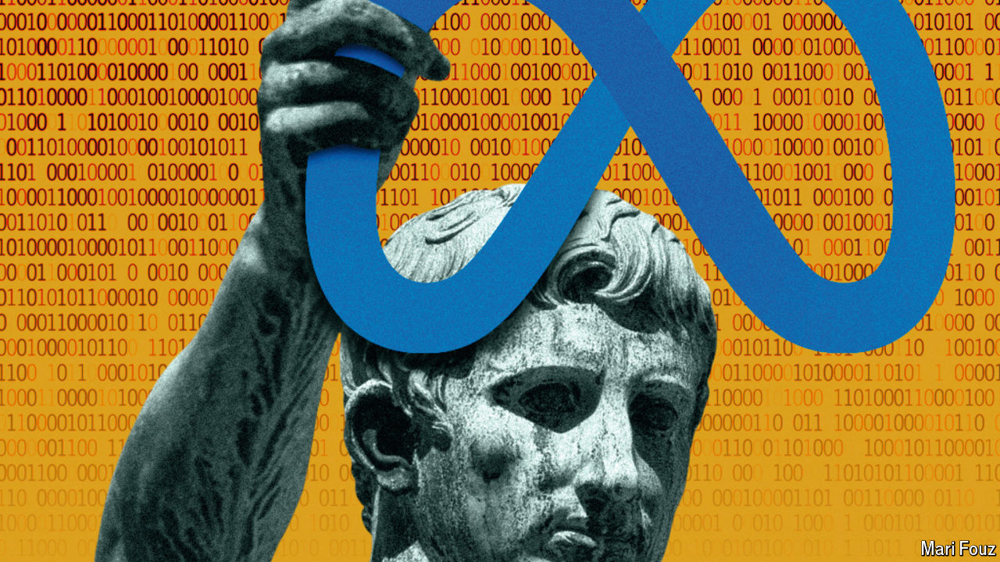

###### Schumpeter

# Why is Mark Zuckerberg giving away Meta’s crown jewels? 

##### Augustus Caesar goes on the open-source warpath 

 

> Jul 24th 2024 

As alter egos go, Augustus Caesar is not a bad one for Mark Zuckerberg,  of Meta, owner of the Facebook family of apps. Both men started their march to power as teenagers. Both stopped at nothing to build empires—though unlike the impetuous Mr Zuckerberg, Augustus’s motto was “make haste slowly”. Both gave the illusion of sharing power (Augustus with the Senate, Mr Zuckerberg with shareholders) while wielding it almost absolutely. The Roman emperor is Mr Zuckerberg’s role model. In a recent podcast he used the 200-year era of stability ushered in by Augustus to illustrate why he is making Meta’s generative artificial-intelligence (AI) models available in a way that, with some poetic licence, he calls open source.

