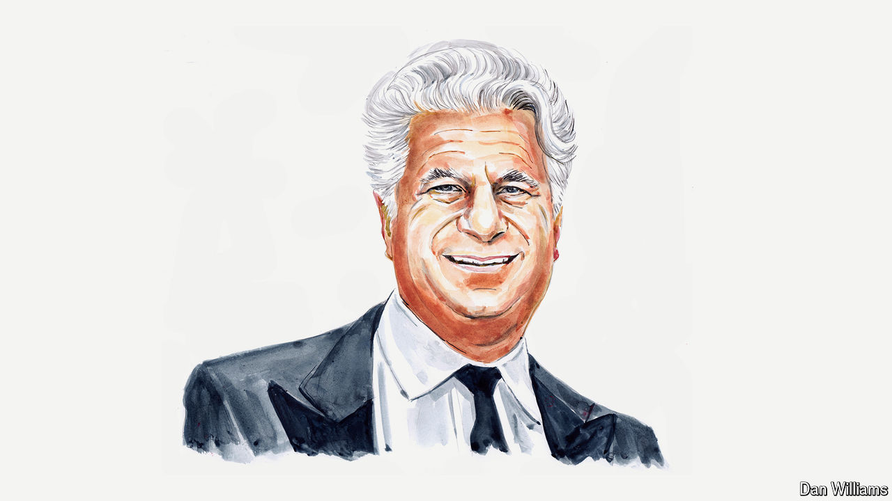

###### The American election

# A prominent donor on why the Democrats shouldn’t anoint Kamala Harris 

##### A competition to replace Joe Biden would better serve the party, and the country, argues Joe Ravitch 

 

> Jul 22nd 2024 

IT IS MONDAY morning in America and President Joe Biden has done the right thing. The Democratic Party now has a historic opportunity to reconnect with voters and change the future. Politics is one of America’s favourite sports. Choosing Mr Biden’s replacement to go up against Donald Trump needs to be the Final Four, the NBA Finals and the Super Bowl all wrapped into one exciting month to engage everyone in a real discussion of the country’s future.

