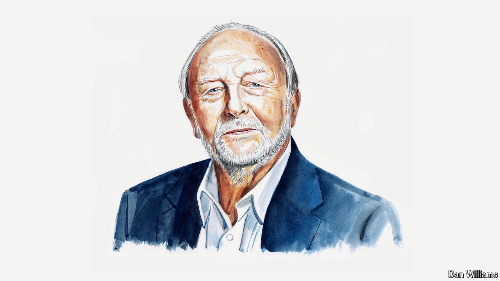

###### The state of Britain

# Neil Kinnock on the post-war-like challenges facing Keir Starmer 

##### A lack of social cohesion compared with 1945 makes them even more daunting, says the former Labour leader and Starmer confidant 

 

> Jul 23rd 2024 

I HAD CERTAINLY not reached political consciousness when the second world war ended. I was, after all, just three years old. But I do remember the period of reconstruction under a Labour government that brought the National Health Service, free secondary schooling, the introduction of meaningful welfare support in unemployment, sickness and old age, legal aid, millions of affordable new homes, public ownership of utilities and the rescue of the coal, steel and rail industries.

