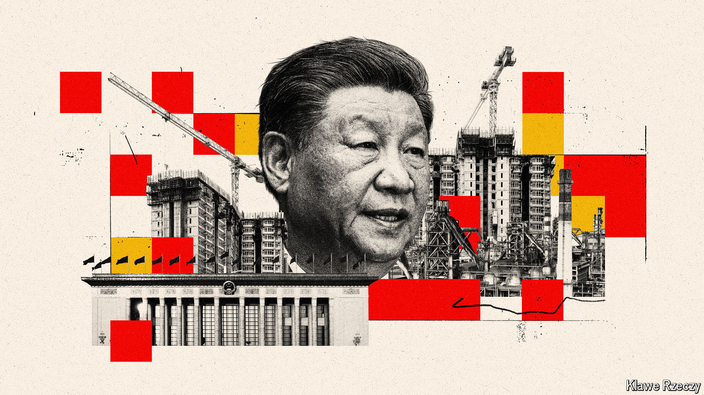

###### An ample supply of promises

# China unveils its new economic vision 

##### It promises many reforms, but remains ambivalent about the role of the market 

 

> Jul 25th 2024 

ONLY 205 of the Chinese Communist Party’s 99m members serve as full members of its Central Committee. Reaching such giddy heights (the top 0.0002%) is not always a privilege. Of late for example, it has meant spending four days in July closeted in a Beijing hotel poring over an epic resolution on “Further Deepening Reform Comprehensively to Advance Chinese Modernisation”. 

