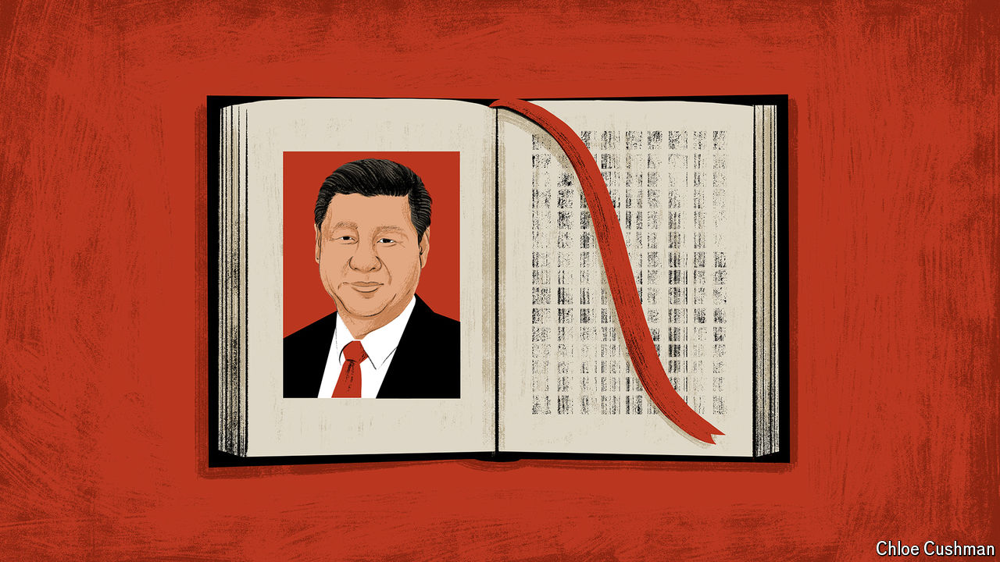

###### Chaguan

# The nationalism of ideas 

##### Xi Jinping wants Chinese systems of knowledge, free of Western values 

 

> Jul 25th 2024 

In beijing a quarter-century ago, Chaguan witnessed a rare event: a criminal court finding a defendant not guilty. Back then, over 90% of Chinese criminal trials ended in convictions. This time the accused—an alleged armed robber—walked free. A lack of hard evidence and his refusal to answer police questions proved decisive. So did his defence lawyer’s plea that it is better to acquit a guilty man than to risk the “horror” of jailing an innocent. 

