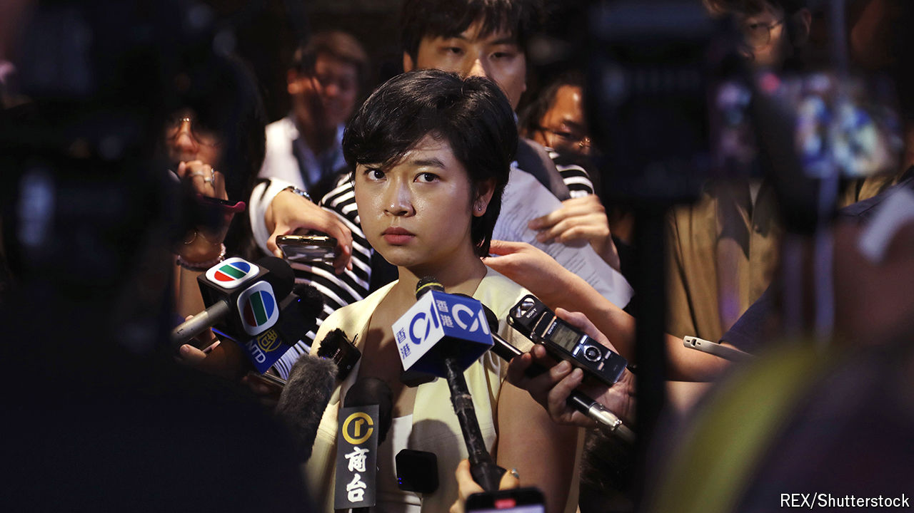

###### The state of the union

# The noose around the press in Hong Kong tightens 

##### Even advocating press freedom begins to seem a bad career move 

 

> Jul 24th 2024 

THE FIRST press conference Selina Cheng gave as chair of the Hong Kong Journalists Association (HKJA), a trade union, on July 17th, was her last as a reporter for the . Ms Cheng says that, shortly after she was appointed, her supervisors at the newspaper ordered her to withdraw, because the two roles were “incompatible” (though her beat was the car industry, not politics), and that when she declined she was fired. 

