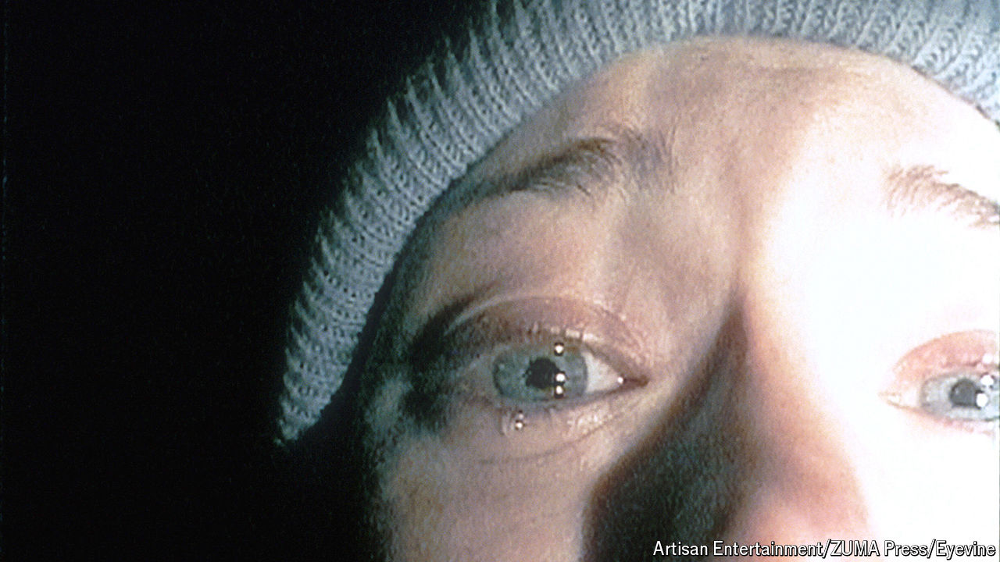

###### Going down to the woods

# How “The Blair Witch Project” changed horror films 

##### Released 25 years ago, it was a masterclass in doing more with less 

 

> Jul 23rd 2024 

IF YOU WANT to scare people, it helps if they believe the tale is real. Mary Shelley opened her novel  (1818) with a series of letters. Bram Stoker put diary entries and newspaper clippings into “Dracula” (1897) to increase its authenticity. But it was , released 25 years ago in July 1999, which most convincingly muddled fact and fiction. In the process, it became one of the most important horror films of all time.

