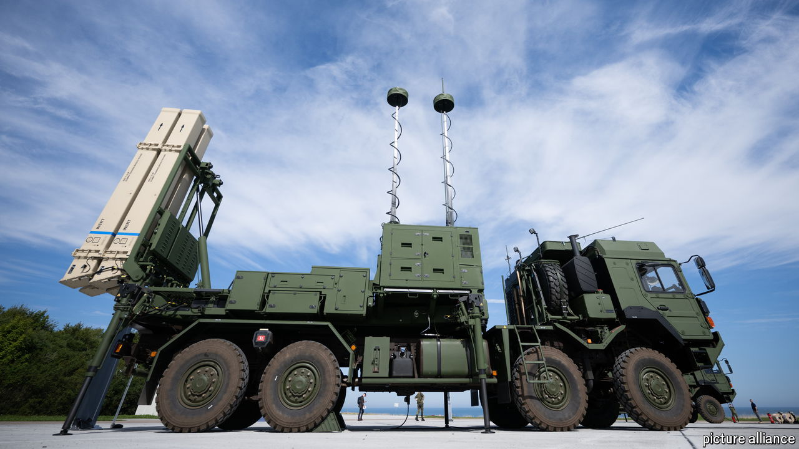

###### Fixing the roof

# European countries are banding together on missile defence 

##### The Ukraine war shows how dangerously few interceptors they have 

 

> Jul 25th 2024 

Europe’s air defences are in a bad state. Its armies have not thought seriously about defending their own skies for some time. But as Russian missiles and drones pound Ukrainian cities, Europe is scrambling to retool. The continent’s missile defences are stretched thin; most countries lack enough interceptors to thwart massed attacks. Many have donated precious batteries to Ukraine. 

