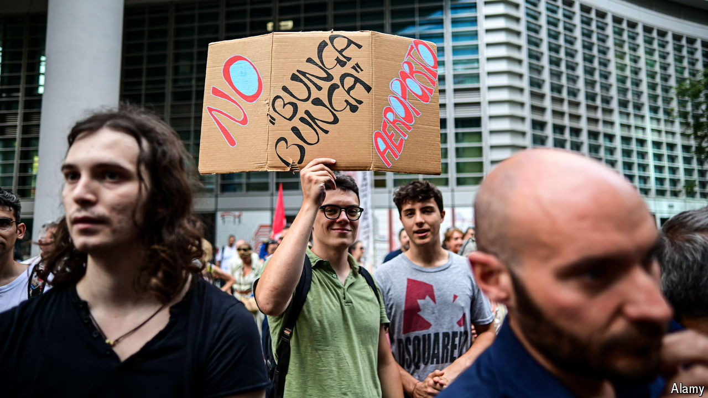

###### Bumpy landing

# Italian right-wingers have renamed Milan’s airport after Silvio Berlusconi 

##### A finger in the eye of those who detested the late populist leader 

 

> Jul 25th 2024 

“I am appalled,” declared an executive of one of Italy’s premier fashion houses, contemplating the prospect of clients and suppliers arriving in Milan at Silvio Berlusconi airport. She is not alone. Although many Italians see the renaming of Malpensa airport on July 11th as a fitting tribute to the republic’s longest-serving prime minister, others are acutely embarrassed. 

