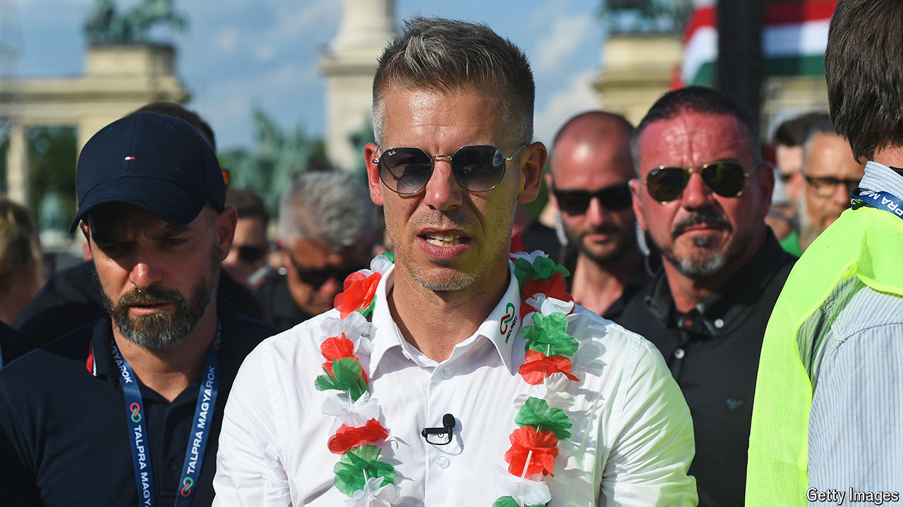

###### The bricklayer

# Peter Magyar is reinvigorating Hungary’s struggling opposition 

##### Attacking Viktor Orban’s corruption wins votes for a political newcomer 

 

> Jul 25th 2024 

VIKTOR ORBAN, Hungary’s right-wing populist prime minister, spent the first week of July on what he called a “peace mission” to Kyiv, Moscow, Beijing and Washington, angering the rest of the EU by undercutting its diplomacy. Back at home, a 43-year-old lawyer named Peter Magyar was trying to poach Mr Orban’s voters. Mr Magyar entered politics early this year by revealing evidence (from conversations with his ex-wife, Mr Orban’s former justice minister) of alleged high-level corruption. In April he launched a new political party, Tisza. On June 9th the upstarts won an extraordinary 30% of the vote in the country’s European Parliament election; Mr Orban’s long-ruling Fidesz party took 45%.

