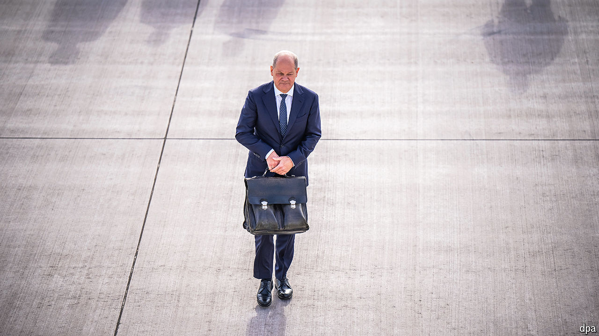

###### Europe’s bantamweight

# The Germany-shaped void at Europe’s heart 

##### Olaf Scholz’s government is punching below its weight in Brussels 

 

> Jul 21st 2024 

LAST MONTH Olaf Scholz and  entered an EU summit with a plan. The German and French leaders agreed that a “strategic agenda” document, drawn up to set the EU’s priorities for the next five years, was inadequate. The passages on climate and migration were weak, and what about defence? But their extensive rewrites, drawn up just before the meeting, sparked a revolt among the other leaders, Italy’s Giorgia Meloni among them. Voices were raised, fingers jabbed, and the pair retreated in humiliation. They had failed the most elementary test of the European Council: avoid springing surprises on your colleagues.

