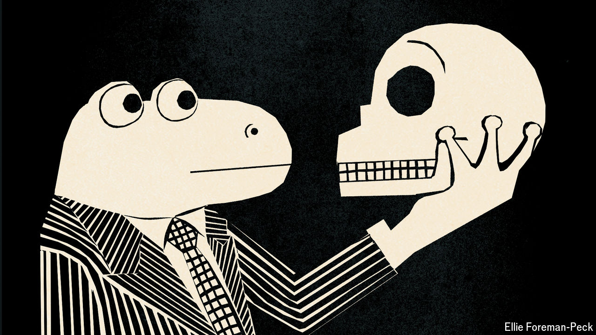

###### Charlemagne

# To understand the perils of AI, look to a Czech novel—from 1936 

##### “War with the Newts” offers a satirical allegory of life under the spell of machines 

 

> Jul 25th 2024 

When historians in future centuries compile the complete annals of humankind, their output will be divided into two tomes. The first will cover the hundreds of thousands of years during which humans have been earth’s highest form of intelligence. It will recount how souped-up apes came up with stone tools, writing, sliced bread, nuclear weapons, space travel and the internet—and the various ways they found to misuse them. The second tome will describe how humans coped with a form of intelligence higher than their own. How did our sort fare once we were outsmarted? Rather thrillingly, the opening pages of that second volume may be about to be written. Depending on whom you ask, artificial general intelligence—systems capable of matching humans, and then leaving them in the cognitive dust—are either months, years or a decade or two away. Predictions of how this might pan out range from everyone enjoying a life of leisure to the extinction of the human race at the hands of paperclip-twisting robots. 

