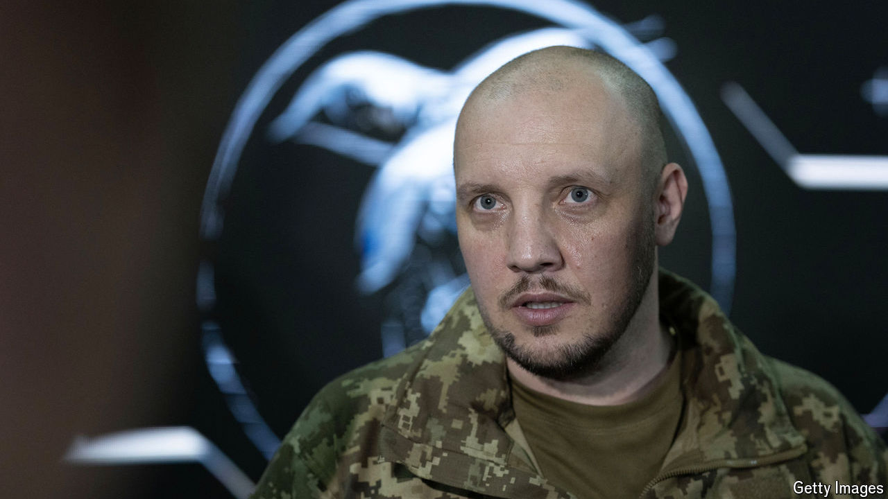

###### Robocommander

# Vadym Sukharevsky, the man in charge of Ukraine’s drones 

##### Ukraine hopes its new drone command will help it regain the upper hand 

 

> Jul 22nd 2024 

VADYM SUKHAREVSKY IS used to a seat in history’s front row. Ten years ago, in April 2014, his machineguns were the first to fire in Ukraine’s anti-terror operation, as the initial phase of the  was known. At the time, Ukraine’s forces were under a strict “no fire” order, even as Russian proxy fighters ran amok in the eastern Ukrainian town of Slovyansk. But the then lieutenant had little hesitation when it became clear that the enemy was preparing an ambush. “See it, shoot it,” he told his soldiers at the time. His fast thinking is credited with saving a dozen lives. The phrase is now embroidered on the gaming chair that swivels at his new command desk. 

