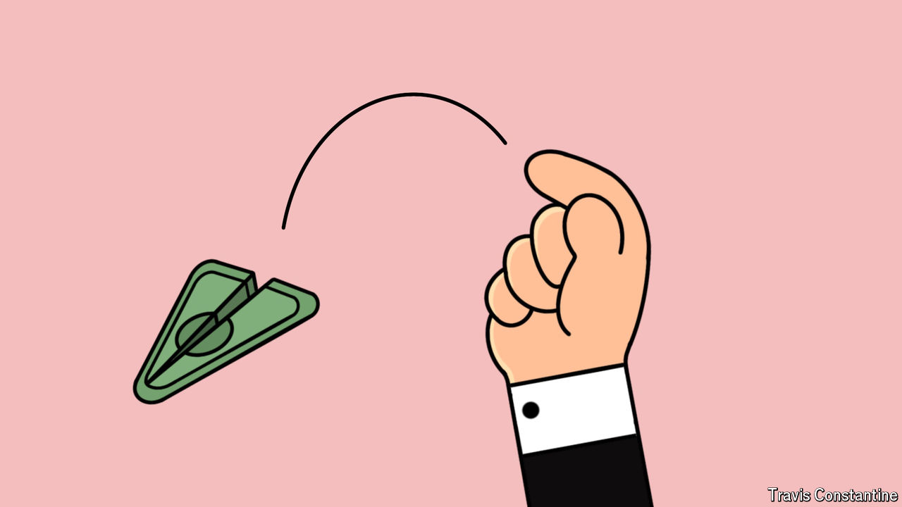

###### Breaking the greenback

# Donald Trump wants a weaker dollar. What are his options? 

##### All come with their own drawbacks 

 

> Jul 25th 2024 

In September 1985, eight months after Ronald Reagan, America’s 40th president, began his second term, finance ministers and central bankers from America, Britain, France, Japan and West Germany met at the Plaza Hotel in New York. They discussed ways to bring down the value of the dollar, which had risen by nearly 50% on a trade-weighted basis between 1980 and Reagan’s second inauguration. Other countries had expressed alarm; the American trade deficit had ballooned. After the group announced that “orderly appreciation of the non-dollar currencies is desirable” and that they were ready to “co-operate more closely to encourage this”, the dollar plummeted. By the late 1980s, it was back where it traded in 1980.

