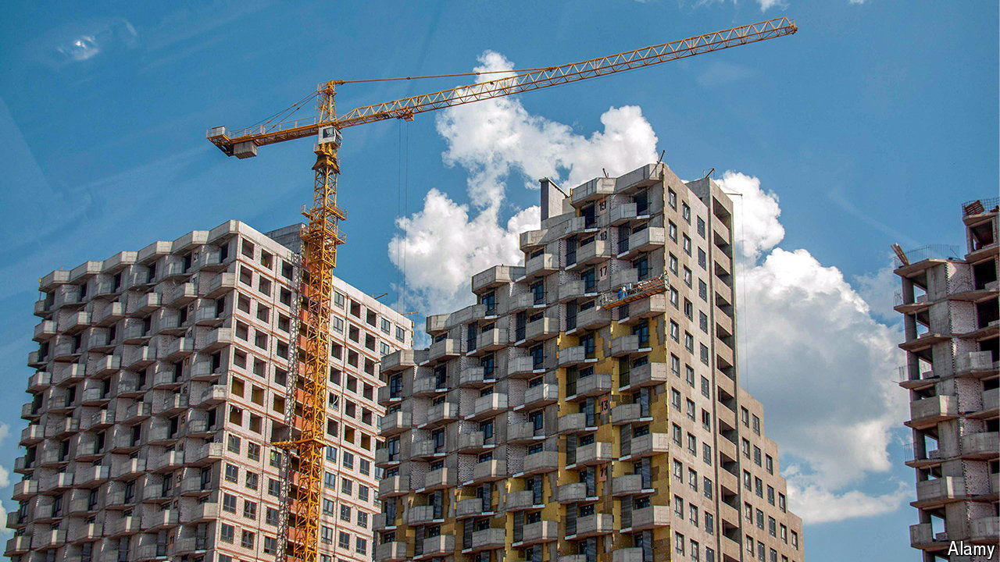

###### War economy

# How Vladimir Putin created a housing bubble 

##### Prices have risen by 172% in Russia’s biggest cities over the past three years 

 

> Jul 22nd 2024 

Mortgages used to be a tough sell in Russia. Decades of Soviet propaganda, which denounced credit as an unbearable burden, had an effect. Even after the end of communism, Russians still referred to mortgages as “debt slavery”, preferring to save until they could buy their homes outright. Vladimir Putin, the country’s president, has spent two decades trying to convince his citizens to take a different view. In 2003, during his first term, he explained that mortgages might help solve “the acute problem of housing” facing Russians. His plea fell on deaf ears.

