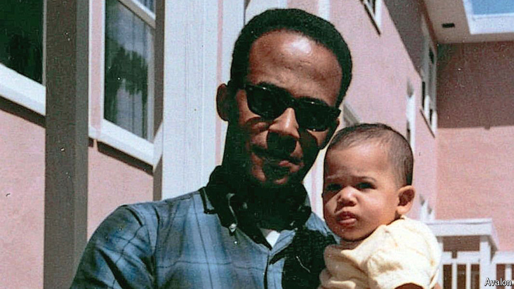

###### Heterodox thought

# Revisiting the work of Donald Harris, father of Kamala 

##### A combative Marxist economist with White House influence 

 

> Jul 25th 2024 

In a video clip that has gone viral recently, Kamala Harris quotes her mother asking her whether she thought she had just fallen out of a coconut tree. The probable Democratic nominee for president breaks into a laugh at the turn of phrase before explaining, somewhat philosophically, the message of the story: “you exist in the context of all in which you live and what came before you.” For Ms Harris some of that context is esoteric economic theory. Her father, Donald, is an 85-year-old, Jamaican-born economist, formerly a professor at Stanford University.

