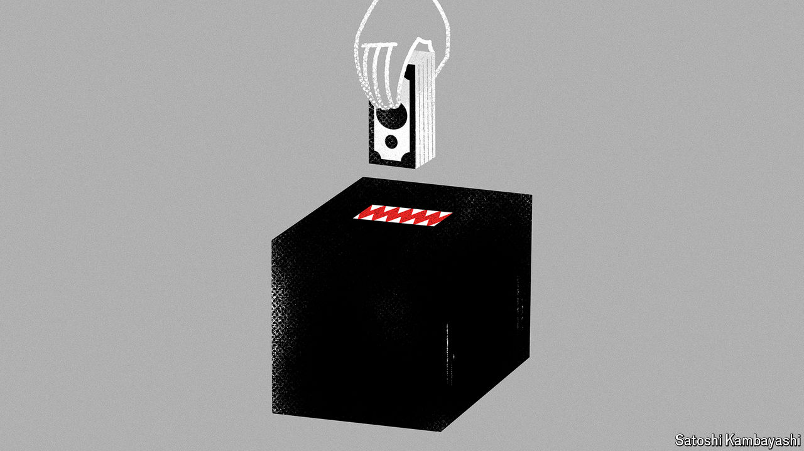

###### Buttonwood

# Why investors are unwise to bet on elections 

##### Turning a profit from political news is a lot harder than it looks 

 

> Jul 25th 2024 

To meet the world’s biggest news junkies, head not to Washington or Westminster. Instead, make your way to a trading floor, where information from every corner of the globe must be parsed the instant it emerges. Whatever the news, from coups to company-earnings reports, it probably affects the price of something. This year, amid a seemingly never-ending series of elections, the addicts are not short of a fix. Electorates representing most of the world’s population are heading to polling booths, and not just market-makers but investors everywhere face the tantalising prospect of trading on the results.

