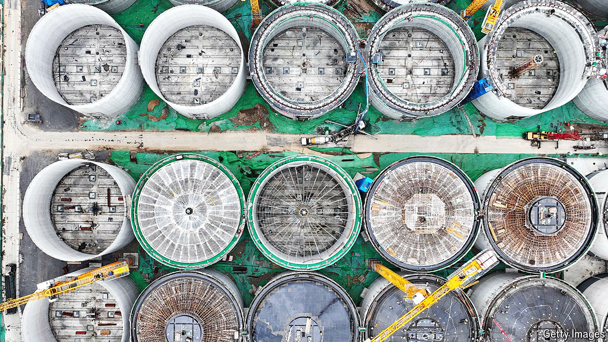

###### China’s reserves

# Why is Xi Jinping building secret commodity stockpiles? 

##### Vast new holdings of grain, natural gas and oil suggest trouble ahead 

 

> Jul 23rd 2024 

Over the past two decades China has devoured enormous amounts of raw materials. Its population has grown bigger and richer, requiring more dairy, grain and meat. Its giant industries have been ravenous for energy and metals. In recent years, though, the economy has suffered from political mismanagement and a property crisis. Chinese officials are adamant that they want to shift away from resource-intensive industries. Logic dictates that the country’s appetite for commodities should be shrinking, and shrinking fast.

