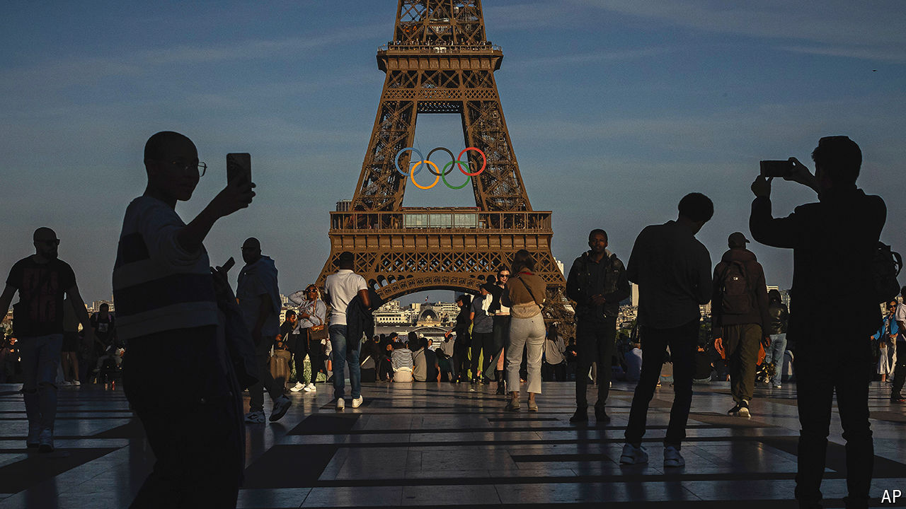

###### A golden opportunity

# Paris could change how cities host the Olympics for good 

##### The games will test the success of new solutions to old bugbears 

 

> Jul 25th 2024 

THE OLYMPIC flame will illuminate the City of Light from July 26th, when the world’s greatest sporting spectacle gets under way in Paris. Although France still lacks a government after a snap national parliamentary vote in recent weeks, its capital will host the 33rd Olympiad in style. Dressage events will take place in the magnificent grounds of Versailles; volleyballs will whizz over nets by the Eiffel Tower. Organisers hope to show the best of France to visiting sports fans, business executives and foreign politicians. One of the thousands of volunteers involved describes “an infectious positive energy”. 

