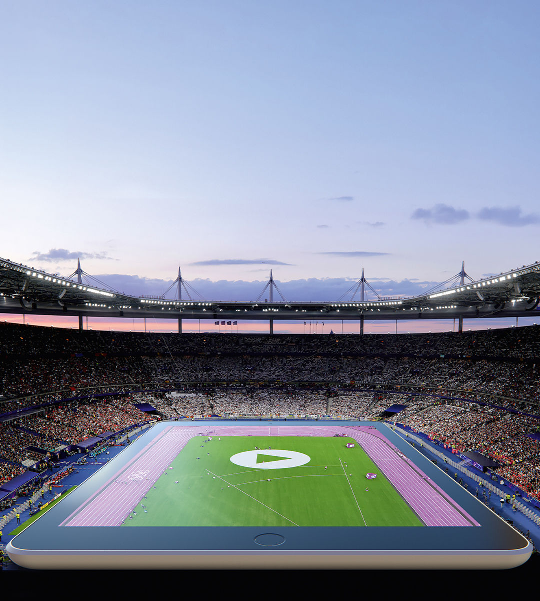

###### Game changer

# A global gold rush is changing sport 

##### Fans may be cooling on the Olympics, but elsewhere technology is transforming how sport is watched 

 

> Jul 25th 2024 

A brawny armada of athletes from more than 200 countries will sail down the  on July 26th, as part of the opening ceremony of the Paris Olympic games. From the Mongolian team in embroidered kaftans to the Canadians in Lululemon bomber-jackets, the procession is designed to symbolise the gathering of every corner of humanity. The message to audiences (and corporate sponsors) is clear: in a fractious, , nothing unites people like sport.

