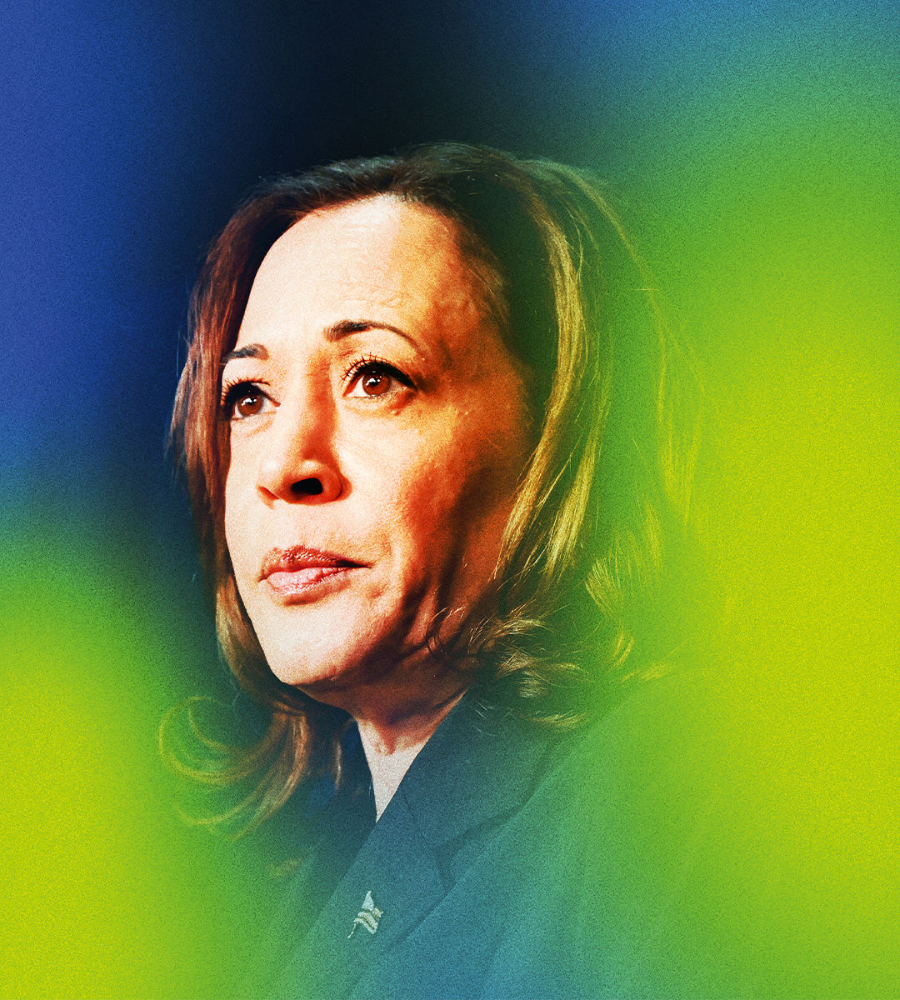

###### American politics

# Can Kamala Harris win? 

##### Joe Biden’s vice-president has an extraordinary opportunity. But she also has a mountain to climb 

 

> Jul 25th 2024 

THE PHONEY campaign has ended. The real battle for the White House will be between Donald Trump and Kamala Harris, and it has only just begun. When Joe Biden  on July 21st, Mr Trump was in a commanding position. With a bit over 100 days to turn around his lead, Ms Harris still has enough time to win the presidency. The question is whether she has the ability. 

