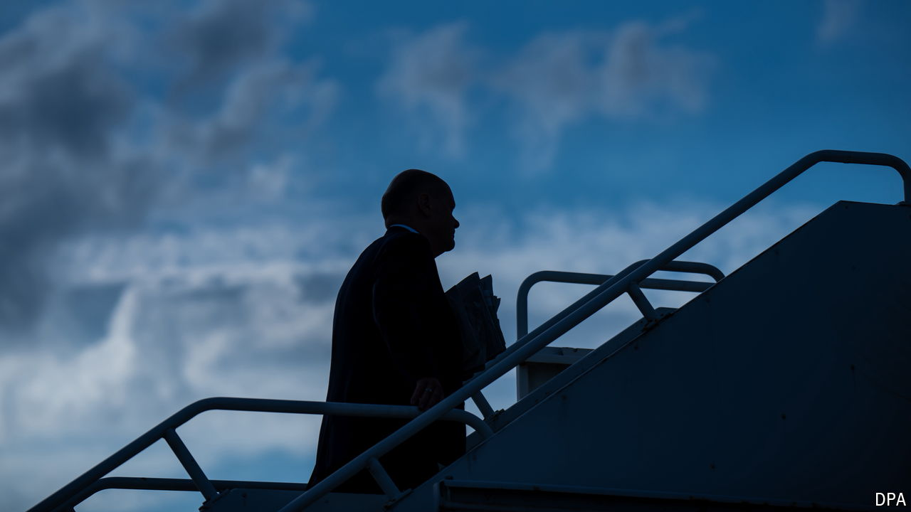

###### The lost leader


# Germany’s failure to lead the EU is becoming a problem 


##### A weak chancellor and coalition rows are to blame 

 


> Jul 25th 2024 


IN THE mid-2010s, as the European Union lurched punch-drunk from one crisis to the next, there was one constant. Germany, and in particular Angela Merkel, its chancellor, was the star around which the rest of Europe orbited.  choked on the austerity they had to swallow as the price of their bail-outs; easterners wished Mrs Merkel had taken a tougher line on Russia after its annexation of  in 2014. All had a point. Yet none had any way of working around Germany.

