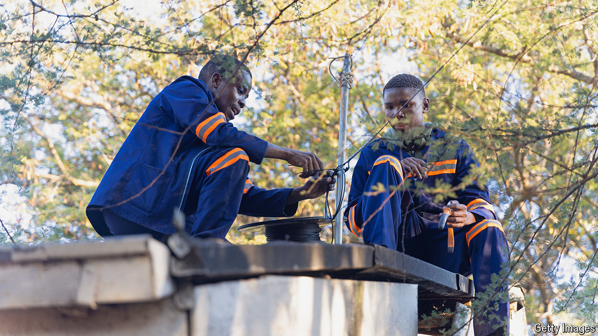

###### Africa 2.0

# How to ensure Africa is not left behind by the AI revolution 

##### Weak digital infrastructure is holding the continent back 

 

> Jul 25th 2024 

More than two decades ago  calculated that all of Africa had less international bandwidth than Brazil. Alas, until 2023 that was still true. Africa’s lack of connectivity is one reason its people could miss out on . 

