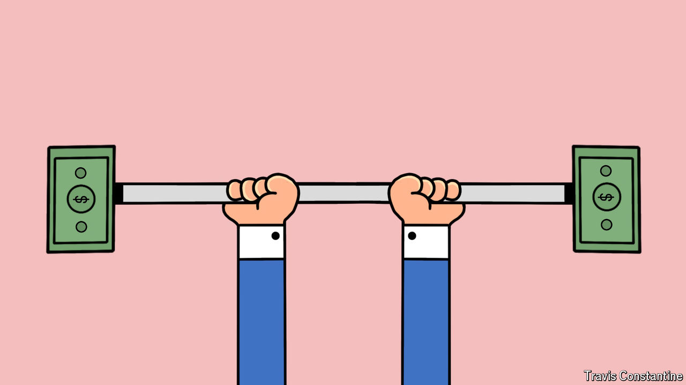

###### Don’t stop the buck

# MAGA Republicans are wrong to seek a cheaper dollar 

##### It is hard to cast America as a victim of the global financial system 

 

> Jul 24th 2024 

Whether the dollar should be strong or weak is a vexing question for America’s economic nationalists. In his first term as president,  often said that he wanted a weaker currency to make American-made goods cheaper overseas. But his tariffs and deficit-financed tax cuts contributed to a surge in the greenback’s value—and he also said that “ultimately” he wanted a strong currency. Today, with the dollar higher still, Mr Trump again says he wants a devaluation. And his choice of  as his running-mate has added another weak-dollar proponent to his inner circle. 

