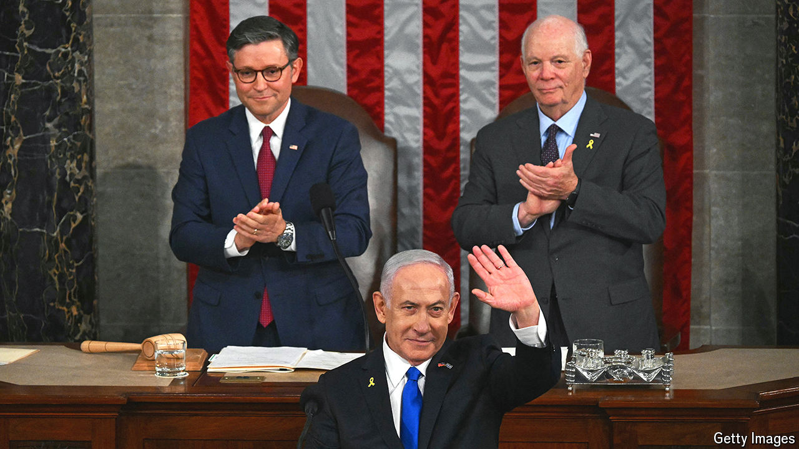

###### Jaw-jaw and war-war

# Bibi Netanyahu offered spectacle over substance in America 

##### His fourth address to Congress was historic, but held few answers for Israelis 

 

> Jul 25th 2024 

The timing of Binyamin Netanyahu’s first trip abroad since Israel’s war in Gaza began over nine months ago was not propitious. The evening before the Israeli prime minister left for Washington, Joe Biden announced that he would not seek reelection as president. American lawmakers were preoccupied with domestic politics even as they welcomed Mr Netanyahu. So, too, was the Israeli prime minister, even as he left his country behind. 

