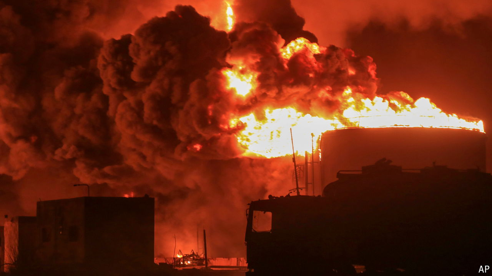

###### Mutual attrition

# Israel and the Houthis trade bombs and bluster 

##### For now, though, neither side is a strategic threat to the other 

 

> Jul 25th 2024 

IT WAS not the first time the Houthis had taken a shot at Israel, not even close. The Shia rebels who control much of Yemen have launched more than 220 missiles and drones at Israel since October. Most have been intercepted over the Red Sea by America and its allies, or shot down by Israel’s air defences. A handful reached southern Israel but did little damage. On July 19th, though, the Houthis hit an apartment building in Tel Aviv, killing one person and wounding at least eight others.

