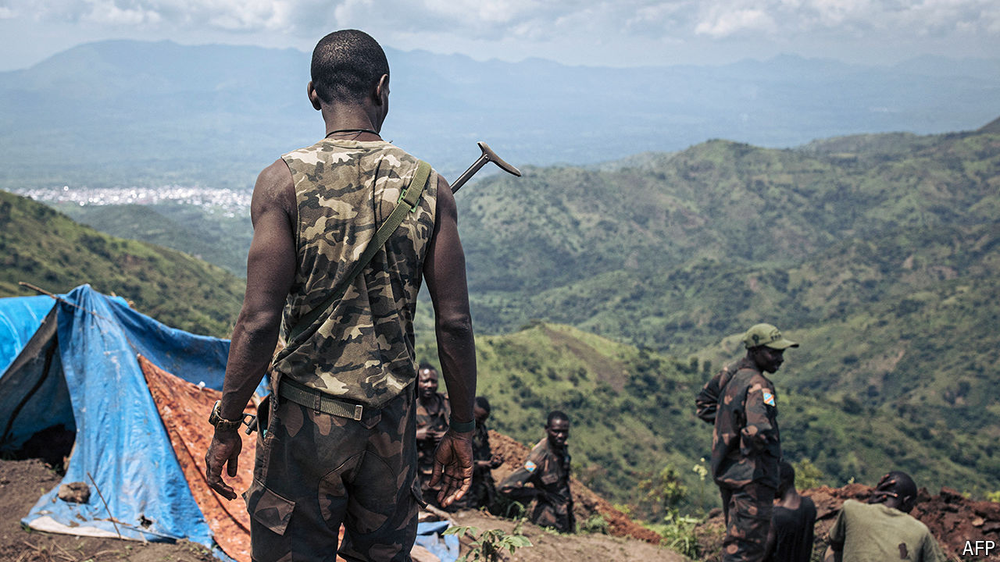

###### Congo’s intensifying war

# Rwandan soldiers may outnumber M23 rebels in Congo 

##### The prospect of dislodging the rebels is becoming dimmer 

 

> Jul 25th 2024 

In January at least 1,000 Rwandan troops crossed into eastern Congo, prompting a huge expansion of the territory under the control of the M23 rebel group. Rwanda’s support for the Tutsi-led militia in the three-year conflict has never been much in doubt: drone images have long shown its soldiers infiltrating the border, and suspiciously advanced weapons have turned up on the battlefield. Rwanda’s government, which previously denied supporting M23, now neither confirms nor denies the presence of its troops in Congo. But a new report by UN experts, circulated this month, suggests that the scale of Rwanda’s intervention is far larger than previously acknowledged. 

