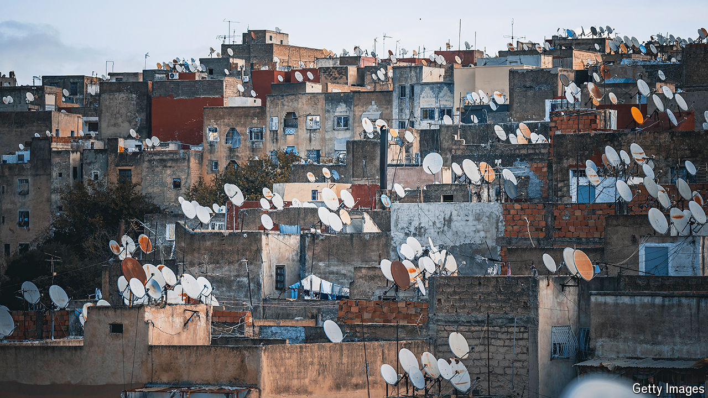

###### Africa unplugged

# Why the AI revolution is leaving Africa behind 

##### Large infrastructure gaps are creating a new digital divide 

 

> Jul 25th 2024 

TWO DECADES ago a digital revolution transformed the lives and livelihoods of millions of people as mobile phones swept across sub-Saharan Africa. A region where a tiny fraction of the population had landline phones or bank accounts was able to leapfrog old telephone monopolies and infrastructure. Mobile phones allowed farmers to get advice on pests and the weather, and the unbanked to send and receive mobile money. Now artificial intelligence (AI) promises to be an even more powerful force for boosting productivity and helping poorer countries overcome shortages of skilled teachers and doctors. Yet where opportunity beckons, Africa is being left behind.

