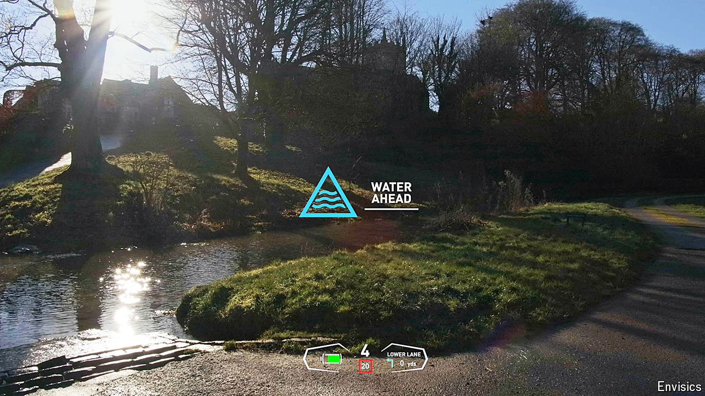

###### Road safety

# Augmented reality offers a safer driving experience 

##### Complete with holograms on the windscreen 

 

> Jul 24th 2024 

While waiting for the traffic lights to change, your correspondent notices a pair of red warning squares appear on the windscreen. They follow a couple of pedestrians as they cross the road directly ahead. Another warning, this time farther in the distance, highlights a third person, harder to spot, stepping out from behind a line of waiting cars. On the move again, a road to the right is illuminated in blue to indicate the turn suggested by the satnav. A local landmark also gets a name tag attached as it passes by.

