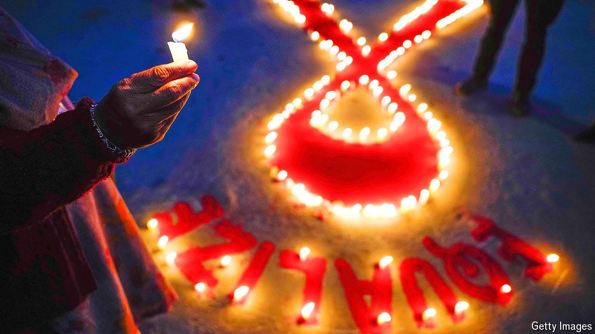

###### The war on AIDS

# Clues to a possible cure for AIDS 

##### Doctors, scientists and activists meet to discuss how to pummel HIV 

 

> Jul 22nd 2024 

On July 22nd the week-long 25th International AIDS Conference kicked off in Munich. Though  are no longer the war councils they were in the epidemic’s early days—for the strategy to defeat HIV is now pretty much settled—there remains much fighting to be done.

