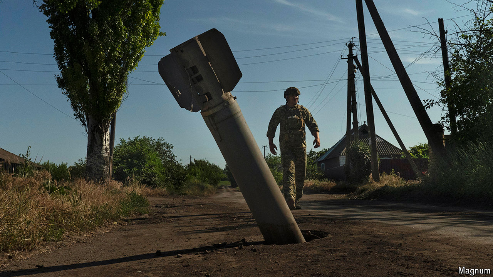

###### Drums of war

# How Ukraine’s new tech foils Russian aerial attacks 

##### It is pioneering acoustic detection, with surprising success 

 

> Jul 24th 2024 

ONCE RUSSIA’S full invasion got rolling on February 24th 2022, Ukraine’s prospects for defending its airspace looked poor. The country’s radar coverage was patchy even before its radar stations came under attack, and many incoming drones and cruise missiles were flying too low to be spotted by stations still standing.

