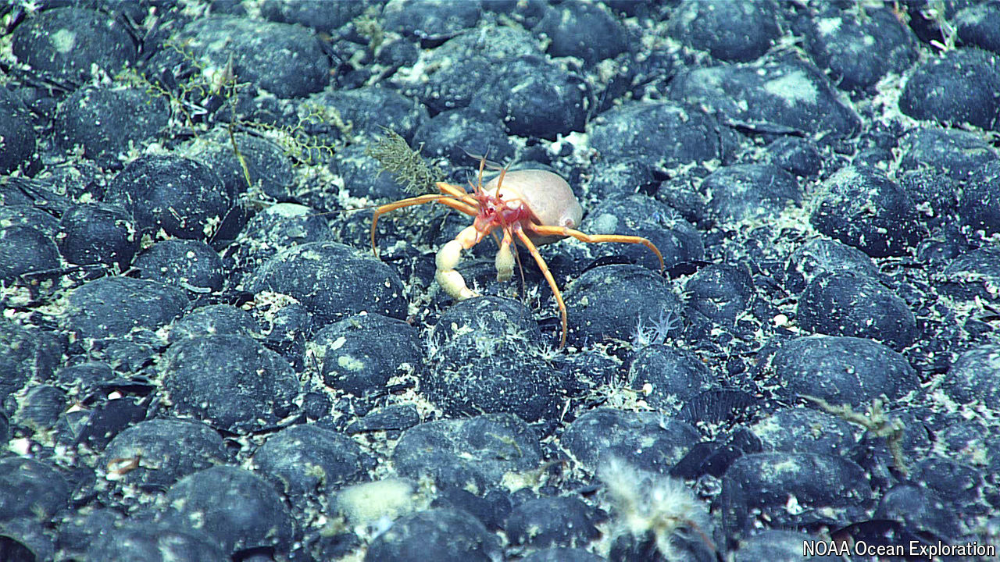

###### Deep breaths

# The deep sea is home to “dark oxygen” 

##### Nodules on the seabed, rather than photosynthesis, are the source of the gas 

 

> Jul 24th 2024 

THE VAST majority of Earth’s oxygen is made as a by-product of photosynthesis, the use of light to convert water and carbon dioxide into sugars. Any oxygen found in regions where photosynthesis is impossible—such as the abyssal seafloor, a pitch-black realm up to 6,000 metres deep—was thought to be surface gas on the move.

