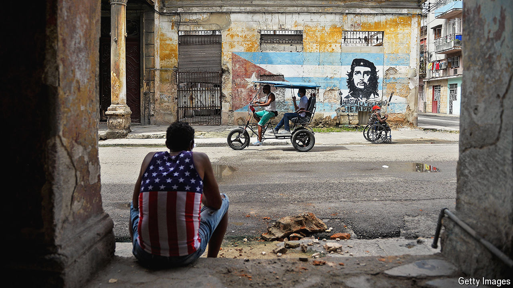

###### On its knees

# Cuba is out of supplies and out of ideas 

##### Penury is pushing the island towards Russia and China 

 

> Jul 21st 2024 

Cubans used to look back at what Fidel Castro called the “special period” after the end of the Soviet Union and its largesse and think that was as bad as things could get. They were too optimistic. Today officials talk of a “”. The consensus on the street in Havana, the capital, is that shortages are worse than in the early 1990s. Cuba produces little in sufficient quantity: not sugar, which it once supplied to the world; not eggs, which it recently imported from Colombia; not milk powder, which it gets from the UN; not power, as worsening blackouts reveal. The government lacks foreign currency for imports. Inflation is rampant; a dollar’s worth of Cuban pesos at the official exchange rate is worth seven cents at the unofficial one. The price of a carton of eggs outstrips the monthly minimum wage.

