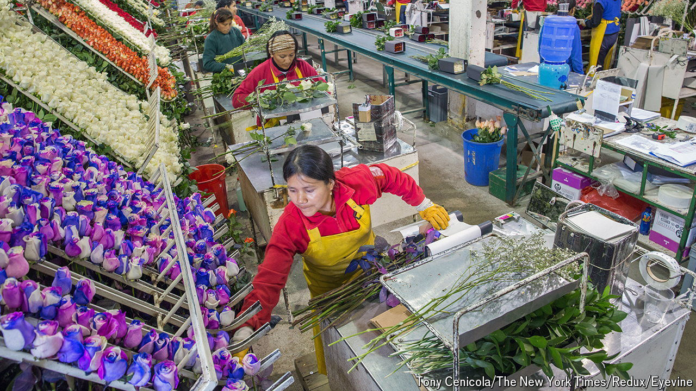

###### Greenback blues

# The strong dollar is hurting exports from Latin America 

##### For three small dollarised economies it has exposed a lack of competitiveness 

 

> Jul 25th 2024 

Conditions in Ecuador’s Andean highlands are ideal for growing roses. The country is one of the world’s biggest exporters of them. But having suffered with the pandemic slump and social unrest in 2022, the rose growers now have another problem. After its currency collapsed, in 2000 Ecuador adopted the American dollar instead. With the dollar now strong, Ecuador’s roses are losing out in world markets to rivals from Colombia, Ethiopia and Kenya. Thanks to a weakening of Colombia’s peso, in 2023 its flower exports were more than 40% higher than before the pandemic, while those from Ecuador had grown by just 12% over the same period.

