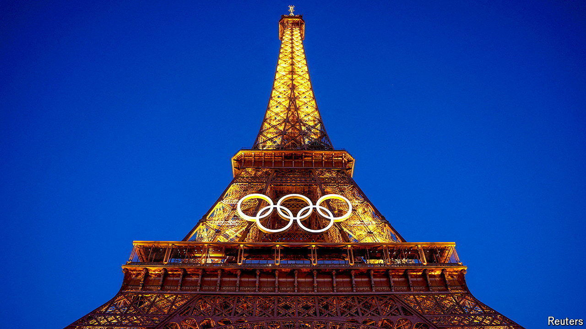

###### The Economist reads

# The romance and reality of Paris, the Olympics’ host 

##### Five non-fiction books about a city that is both gilded and gritty 

 

> Jul 23rd 2024 

PARIS LIFTS the soul, and then exasperates. It expresses reason in its orderly layout and tugs at the heart. The City of Lights mixes magic with the mundane: it is a place of bridges in the moonlight and harshly lit RER underground stations; zinc rooftops and brutalist tower blocks; fine dining and fury on the streets. As the host of the Olympic games, which begin on July 26th, Paris is more than ever a showcase, set to dazzle and delight the world. But the French capital’s often-hidden complexity and paradoxes are also part of its richness. This selection of non-fiction books—most of them by outsiders who have adopted Paris in some way—convey the character of a city that is both familiar and mysterious.

