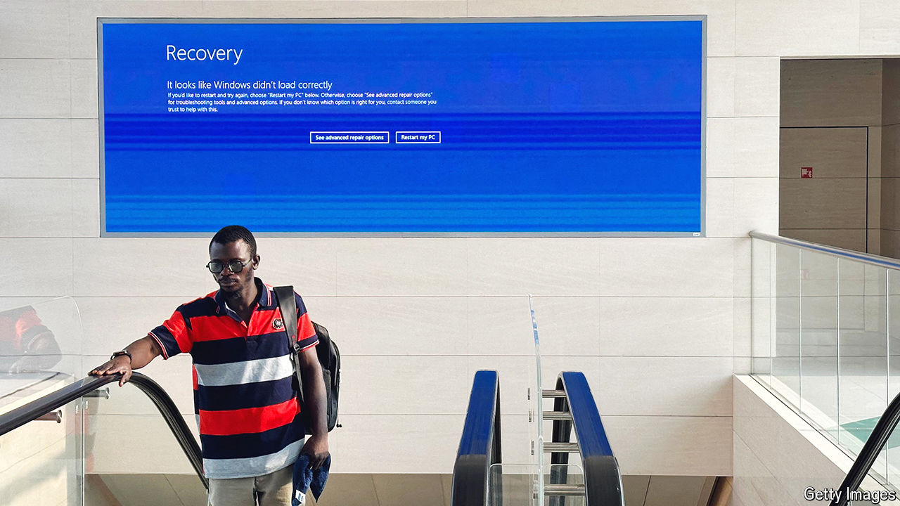

###### The world this week

# Business 

#####  

 

> Jul 25th 2024 

The fallout from a botched software update by , which on July 19th triggered one of the biggest-ever IT outages, continued to disrupt firms around the world. By knocking out equipment relying on , the malfunction caused thousands of flights to be cancelled, hospital operations to be delayed and banks to temporarily cease trading. Some businesses may take weeks to recover. Insurers are preparing for losses stretching into the billions.

